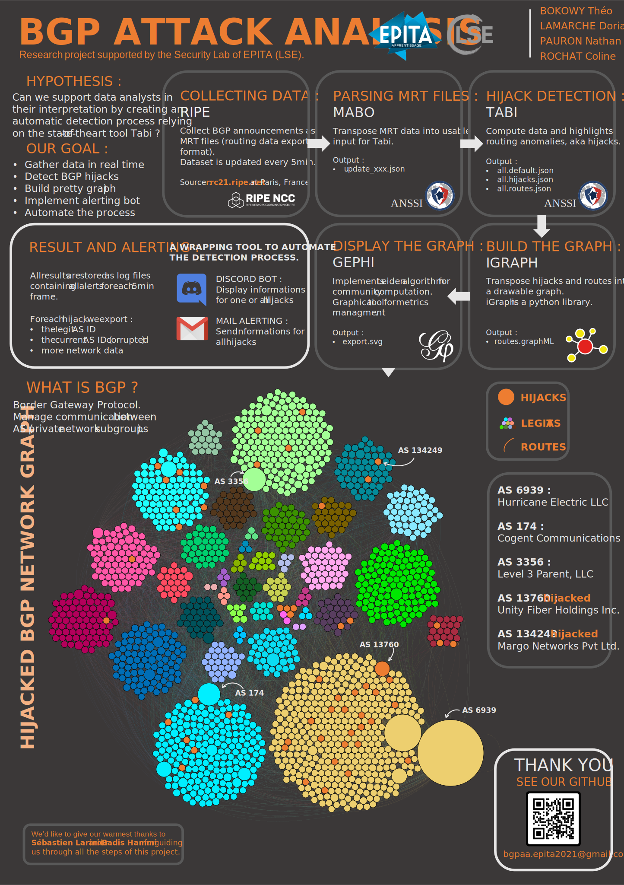

# BGPAA
Research Project supported by the Security Lab of EPITA (LSE).
This project is mainly written in python.
The process automatically retrieves MRT files from RIPE, detect hijacks, and export results as log files and the graph of all AS routes, highlighting attacks.

[Check the overview of the process here.](#bgpaa-project-overview)

# Requirements :
## Mabo & Tabi build

### Ocaml requirements for mabo
```sh
sudo apt-get install make oasis libbz2-ocaml-dev libzip-ocaml-dev libyojson-ocaml-dev gcci
```

### Build Mabo and Tabi
Keep in mind that Tabi requires Python 2.7
```sh
./setup.sh
source tabi-master/ve-tabi/bin/activate
pip2 install cairocffi beautifulsoup4 pytz wget requests python-igraph==0.8.3
cd tabi-master
python setup.py install
cd ..
```

## Gephi requires Java 8
### On debian
https://www.digitalocean.com/community/tutorials/how-to-install-java-with-apt-get-on-debian-8

#### JRE/JDK 8
```sh
sudo apt-get update
sudo apt-get install default-jre
sudo apt-get install default-jdk
```
#### Oracle JDK 8
```sh
sudo apt-get install software-properties-common
sudo add-apt-repository "deb http://ppa.launchpad.net/webupd8team/java/ubuntu xenial main"
sudo apt-get update
sudo apt-get install oracle-java8-installer
```

### Pro Tips
```conf
#gephi-0.9.2/etc/gephi.conf
...
# default location of JDK/JRE, can be overridden by using --jdkhome <dir> switch
jdkhome="/usr/lib/jvm/java-8-openjdk-amd64"
```

## Launch the project
### -new
Download and execution of the newest update from RIPE. 
```sh
./detect.sh -new
```
### -graph
Execution and graph generation of all.routes.json.
```sh
./detect.sh (-new | <mrt_file.gz>) -graph
```
### -timewindow
Execution on a given time window (time format = 'YYYY-mm-DD_HH:MM', latest data will be downloaded from RIPE) and graph generation.
```sh
./detect.sh -timewindow <start_time> <end_time>
```

### execute as a crontab
To start loading the job automatically after each 5min update from RIPE, and store results in 'archives', add this to your crontab :
```sh
*/5 * * * * ./detect.sh -new
55 23 * * * python3 alerting/alert_mail.py
```

This will start both the discord bot (which will display hijacks results avery 5min) and the mail alerting (which will send each day all the hijacks detected during the day).

## Gephi guide to get readable graphs
### Pre-requisites
Go to Tools > Plugin > Available Plugins.
Install Circle Pack (Layout) and Leiden Algorithm (Clustering).

### Start
Open "routes.graphML".
 
### Statistics
Run Leiden Algorithm with Modularity and Resolution = 1.
Run Avg. Path Length.

### Color clusters
Go to Nodes > Color > Partition; pick Cluster; click on Palette > Generate; uncheck Limit numbers of color; click on Generate; then ok; Apply.

### Color hijack / binary
Go to Nodes > Color > Partition; pick Hijack; Apply.

### Assign label sizes
Go to Nodes > Label Size > Ranking; pick Betweeness Centrality; Apply.

We recommend Min Size = 0.1 and Max Size = 3.

### Assign sizes to nodes
Go to Nodes > Size > Ranking; pick Betweeness Centrality; Apply.

We recommend Min Size = 10 and Max Size = 100.

### Layout
Pick the Circle Pack Layout with Hierarchy1, based on Cluster (Attribute).

Assign sizes before running a layout to avoid overlapping.

### Preview before export
Go to preview tab; choose Default Curve; Refresh.

## How to use the logs from TaBi :

collector : which BGP collector received the announce

conflict_with -> prefix : address block with which there is a conflict

conflict_with -> asn    : AS with which there is a conflict

timestamp : when the announce was received (UTC timestamp)

peer_ip : which BGP peer (neighbor) received the announce

peer_as : which BGP (neighbor) peer received the announce

announce -> prefix

announce -> asn

announce -> as_path : the "as_path" of the hijacker contains the ASN of the hijacked

type : either "U" if the announce was received from a BGP update or "F" if it was from a BGP full view

# Alerting system :

## Bot Discord

### Requirements
Python 3
```sh
pip install discord asyncio
```
Update the token in 'alert_discord.py'.
Only authorized people will access it.

### !bgpha
Display all the hijacks caracteristics detected during a 5min time window.

### !bgphn
Display the number of hijacks detected during a 5min window.

### !bgpho
Display a specific hijack caracteristics detected during a 5min time window.

### !help
Display help.

## Mail Alerting
Setup your smtp server, sender info and the mailing list in 'alert_mail.py'.
A mail will be sent each day (see crontab) with all the hijacks of the day. 

# Process explanation :
TODO

## BGPAA project overview

